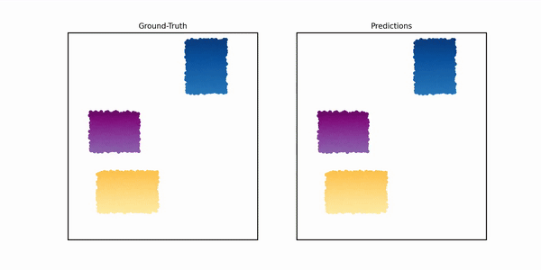

# NeuralMPM

 [[website](https://neuralmpm.isach.be)] [[arXiv](https://arxiv.org/abs/2408.15753)] [[paper](https://arxiv.org/pdf/2408.15753)] [[data](https://huggingface.co/datasets/iSach/NeuralMPM)]

This repository contains the code for the paper [A Neural Material Point Method for Particle-based Emulation](https://arxiv.org/abs/2408.15753) by [Omer Rochman Sharabi](https://omerrochman.github.io), [Sacha Lewin](https://isach.be), and [Gilles Louppe](https://glouppe.github.io).



> [!CAUTION]
> Although this code was thoroughly tested for release, it might still contain inconsistencies or bugs. Feel free to open an issue.

### Installation

1. Create a clean environment with Python 3.10.

```bash
conda env create -n neuralmpm python=3.10
conda activate neuralmpm
```

2. Install `neuralmpm` as a local and editable package. Replace `cu121` with your CUDA version if needed (e.g., `cu118` for CUDA 11.8).

```bash
pip install -e . --extra-index-url https://download.pytorch.org/whl/cu121
pip install -e .[geom] -f https://data.pyg.org/whl/torch-2.5.0+cu121.html
```

> We recommend using a Slurm cluster if possible.

### Downloading data

The datasets included in the paper are available on [HuggingFace here](https://huggingface.co/datasets/iSach/NeuralMPM).

Most information can be found on the Hugging Face repository. Available datasets include:
- `WaterRamps` (from [GNS](https://github.com/google-deepmind/deepmind-research/tree/master/learning_to_simulate))
- `SandRamps` (from [GNS](https://github.com/google-deepmind/deepmind-research/tree/master/learning_to_simulate))
- `Goop` (from [GNS](https://github.com/google-deepmind/deepmind-research/tree/master/learning_to_simulate))
- `MultiMaterial` (from [GNS](https://github.com/google-deepmind/deepmind-research/tree/master/learning_to_simulate))
- `DamBreak2D` (from [LagrangeBench](https://github.com/tumaer/lagrangebench))
- `VariableGravity`

If you're new with Hugging Face, here are the instructions to download one of the datasets (WaterRamps).

1. We recommend using the Hugging Face CLI, which you can install with:

```bash
pip install "huggingface_hub[cli]"
```

2. Create a data folder

```bash
mkdir data
```

3. Use the Hugging Face CLI to download the dataset:

```bash
huggingface-cli download --repo-type dataset "iSach/NeuralMPM" --include "WaterRamps/" --local-dir data
```

4. Unzip each file in the `data` directory. You can use the following command:

```bash
find data -name "*.zip" -exec sh -c 'unzip -o "$1" -d "$(dirname "$1")" && rm "$1"' _ {} \;
```

The final structure should look like this:

```
data
└── WaterRamps
    ├── train
    │   ├── sim_0.h5
    │   ├── sim_1.h5
    │   └── ...
    ├── test
    │   ├── sim_0.h5
    │   ├── sim_1.h5
    │   └── ...
    └── valid
        ├── sim_0.h5
        ├── sim_1.h5
        └── ...
```

### Training a model

#### Slurm credentials

Before training (and performing other tasks) on your Slurm cluster, define your credentials, partitions, and settings in [`neuralmpm/configs/slurm.py`](neuralmpm/configs/slurm.py).

#### Pre-defined experiments

We provide a way to easily run pre-defined experiments. They are defined in [`neuralmpm/configs/configs.py`](neuralmpm/configs/configs.py), and you can run them using the `nmpm-exp` command. By default, we provide:
- `DEFAULT`: Default parameters for all experiments. If you do not specify a parameter in another experiment, it will use the default value.
- `paper`: Runs the results for each of the 6 main dataserts in the paper.
- `toy`: Tests your installation with a very small model for a few iterations.

Each experiment field can be composed as a tuple to make a batch of experiments. Do not run these locally.

To run an experiment, simply do:
```
nmpm-exp DEFAULT [--local] [--data ...] [--save-every n]
```

Parameters:
- `--local`: If set, will run the experiment locally instead of on a Slurm cluster. Only recommended if you're running a single experiment (no tuples like in the `paper` experiment).
- `--data`: If set, will override the dataset defined in [`neuralmpm/configs/configs.py`](neuralmpm/configs/configs.py).
- `--save-every`: Saves the model every `n` minutes.


> We highly recommend using a Slurm cluster. You can use `--local` to run the experiment locally, but pay attention to run them one at a time then, otherwise it will start all experiments at once.

#### Custom training

Besides specifying experiments in [`neuralmpm/configs/configs.py`](neuralmpm/configs/configs.py), you can also directly run a training job using `nmpm-train`.

```bash
nmpm-train --data data/... [options]
```

Parameters:
- `dataset-type`: Type of dataset to use (parsers are in [`neuralmpm/data/data_manager.py`](neuralmpm/data/data_manager.py): multimat, wdxl, monomat3d, watergravity, dam2d)
- `data`: Path to dataset (required)
- `nowandb`: Disable Weights & Biases logging
- `slurm`: Enable Slurm-compatible behavior
- `epochs`: Number of training epochs (default: 50)
- `name`: Name of the run
- `project`: Name of the project (default: NeuralMPM)
- `steps-per-call`: Time bundling steps per model call (default: m=8)
- `autoregressive-steps`: Autoregressive steps during training (default: K=3)
- `grid-size`: Grid resolution, e.g., 64 128 (default: [64, 64])
- `model`: Model type (default: unet)
- `batch-size`: Training batch size (default: 128)
- `passes-over-buffer`: Passes over buffered simulations (default: 20)
- `sims-in-memory`: Simulations loaded per buffer (default: 16)
- `architecture`: Hidden channels for the UNet for each downsampling block. Upsampling is reversed.
- `particle-noise`: Noise added to particles (default: 0.0003)
- `grid-noise`: Noise added to grid values (default: 0.001)
- `lr`: Initial learning rate (default: 1e-3)
- `min-lr`: Minimum learning rate (default: 1e-6)
- `use-schedulers`: Enable LR schedulers
- `no-skip-steps`: Do not skip M steps
- `no-gpu`: Run on CPU (discouraged)


### Rolling out a model on some data

You can roll out a model using the `nmpm-rollout` command. You can also specify a different dataset for experiments like generalization, using `--data`.

```bash
nmpm-rollout --run outputs/... [--data ...]
```

### Evaluating a model

You can evaluate the performance of a given model on some data using the `nmpm-eval` command. By default, this will only compute the MSE locally. You can also distribute it over a Slurm cluster as well as compute EMD. *You must roll out before evaluating!* Again, data must only be specified if you rolled out on a different dataset than the one used for training.

```bash
nmpm-eval --run outputs/... [--data ...] [--distributed] [--emd]
```

Parameters:
- `--run`: Path to the run directory containing the model and config.
- `--data`: Path to the data directory. If not specified, it will use the data used for training.
- `--distributed`: If set, will distribute the evaluation over a Slurm cluster.
- `--emd`: If set, will compute the Earth Mover's Distance (EMD) in addition to the MSE. *Requires Jax and is slow!*

### Rendering trajectories

The `nmpm-render` command allows to easily render trajectories as frames or videos. Again, data must only be specified if you rolled out on a different dataset than the one used for training.

Parameters:
- `--run`: Path to the run directory containing the model and config.
- `--data`: Path to the data directory. If not specified, it will use the data used for training.
- `--ids`: List of simulations to render.
- `--engine`: Rendering engine to use, either `v1` or `v2`. v2 produces better quality but is ***much*** slower!
- `--steps`: For rendering frames, the time steps to render.

#### Videos

```bash
nmpm-render video --run outputs/... [--data ...] [--ids 10-50] [--engine v1|v2]
```

#### Frames

```bash
nmpm-render frames --run outputs/... [--data ...] [--ids 10-50] [--engine v1|v2] [--steps 0-25,18-30]
```

### Pre-trained models

We will soon provide on Hugging Face pre-trained models for the datasets in the paper. If you struggle to reproduce our results, please get in touch with us!

### Citation

If our work was useful to you, please consider citing our paper:
```bibtex
@article{
    rochman-sharabi2025a,
    title={A Neural Material Point Method for Particle-based Emulation},
    author={Omer Rochman-Sharabi and Sacha Lewin and Gilles Louppe},
    journal={Transactions on Machine Learning Research},
    issn={2835-8856},
    year={2025},
    url={https://openreview.net/forum?id=zSK81A2hxQ},
}
```
